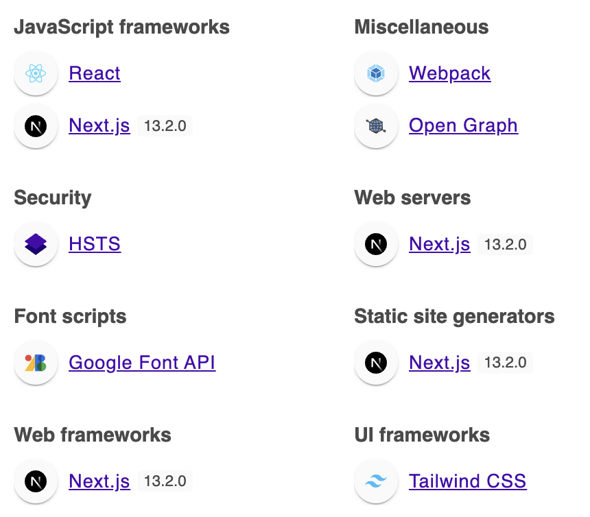
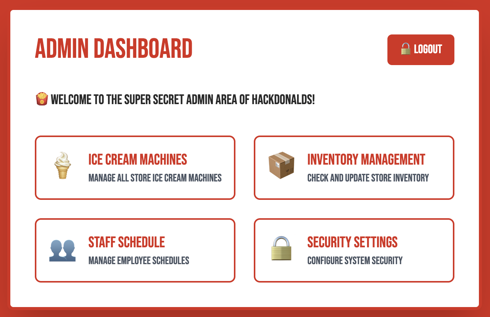
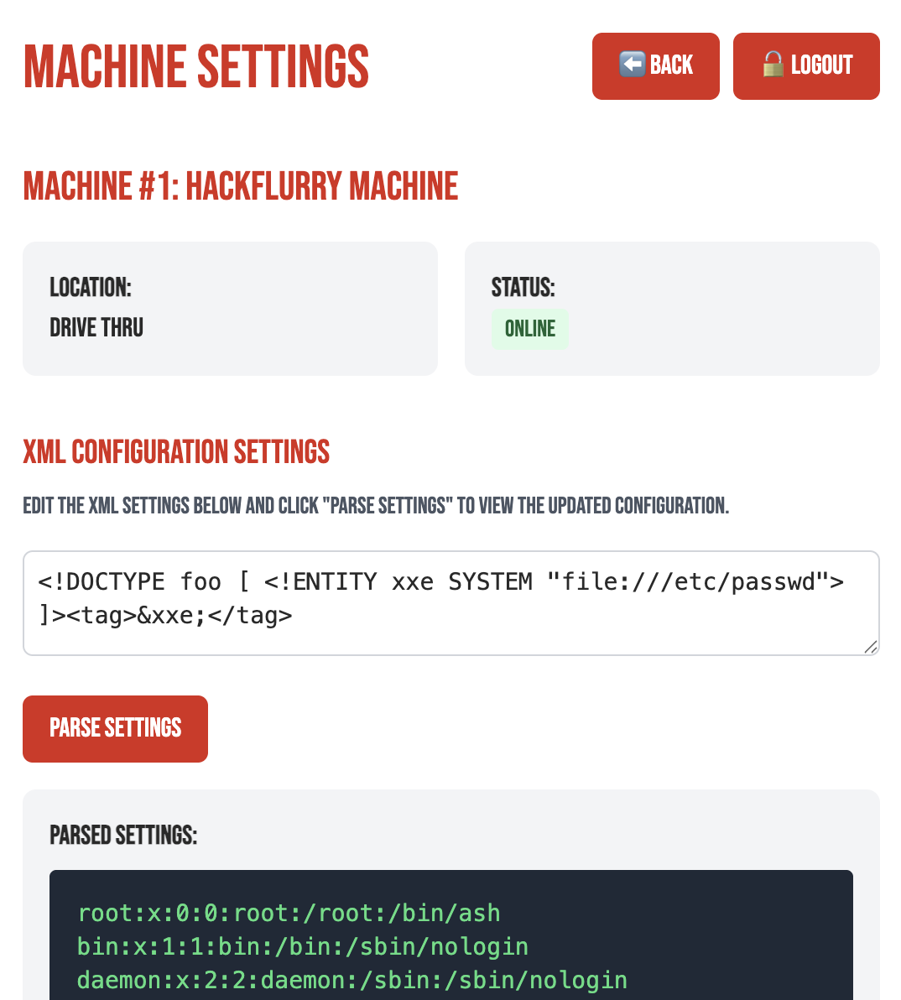
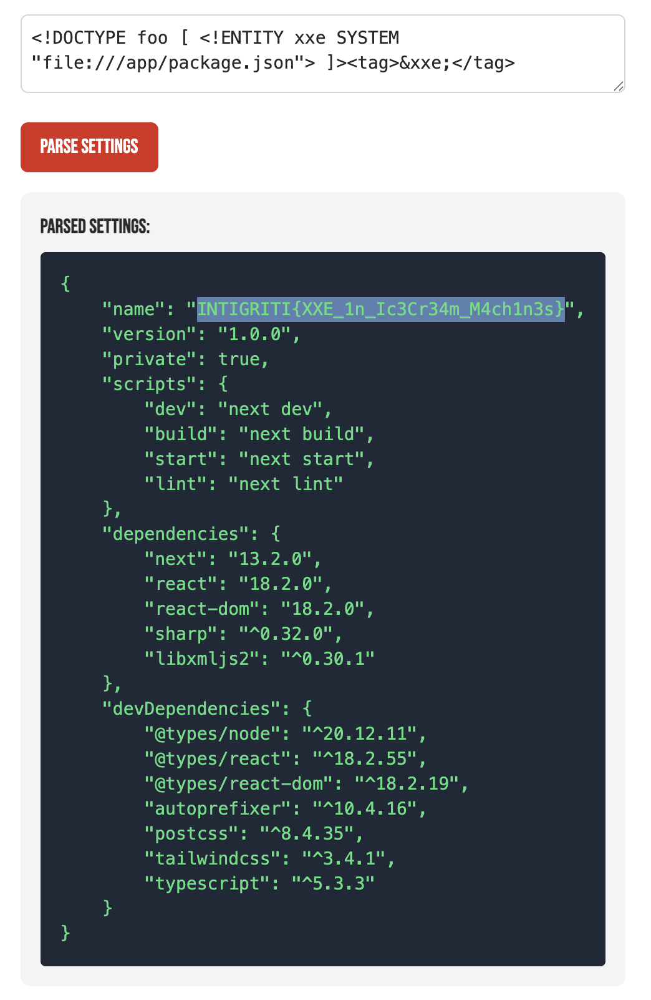
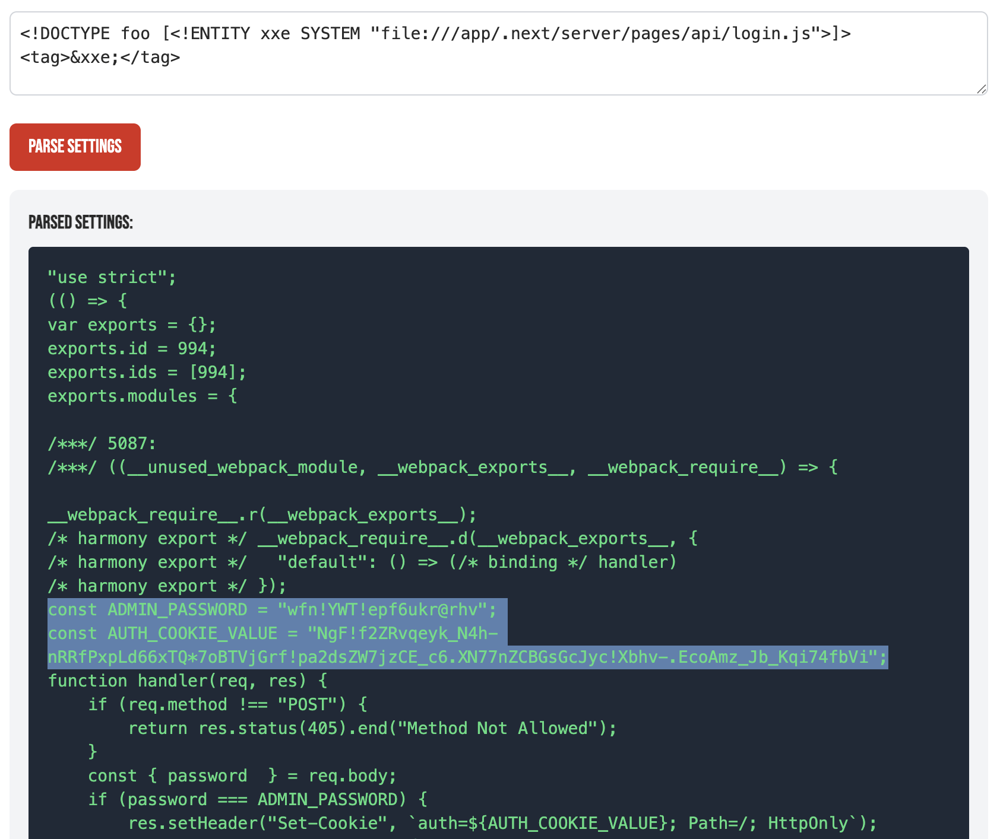

# Intigriti's HackDonalds Challenge
[Intigriti](https://intigriti.com) had a [capture the flag (CTF)](https://en.wikipedia.org/wiki/Capture_the_flag_(cybersecurity)) challenge going from April 7th to April 14th 2025.

**Announcement:** https://x.com/intigriti/status/1909237159418044886  
**CTF site:** https://intigriti.com/programs/intigriti/challenge-hackdonalds  
**Target box:** https://hackdonalds.intigriti.io  
**Prices:** 🩸 €50 for swag voucher for first blood, 📝 €50 swag voucher for best writeup
  

---

- Table of Contents
  * [Challenge](#challenge)
  * [Tools used](#tools-used)
  * [Part 1 - Gaining admin access](#part-1---gaining-admin-access)
  * [Part 2 - Getting the flag](#part-2---getting-the-flag)
  * [Flag](#flag)
  * [Bonus](#bonus)
  * [Some final thoughts](#some-final-thoughts)

---

## Challenge
> Find the FLAG (format will be INTIGRITI{.*}) on https://hackdonalds.intigriti.io and win Intigriti swag!

## Tools used
 - [Chrome DevTools](https://developer.chrome.com/docs/devtools)
 - [Wappalyzer Chrome extension](https://chromewebstore.google.com/detail/wappalyzer-technology-pro/gppongmhjkpfnbhagpmjfkannfbllamg)
 - [Caido](https://caido.io)
 - [ChatGPT](https://chatgpt.com)

## Part 1 - Gaining admin access
The website seemed to be your average fast food & exploit restaurant with a great and cheap menu. There was also a link to a `/admin` path which redirected to `/login`.   

> [!TIP]
> Even though the admin page gave a redirect server side it was still possible to see the contents of it, as it was part of the JavaScript returned from the server. Developers are not always aware of this, but even if they are, it can give you as a bug bounty hunter valuable insight into how things function, links, API calls, etc.

🎯 **Finding:** Using the Wappalyzer Chrome extension I saw that the server was running Next.js version 13.2.0. This version has the critical authorization bypass [CVE-2025-29927](https://github.com/advisories/GHSA-f82v-jwr5-mffw).

In short, the vulnerability lets you bypass _middleware_ - including authorization checks on the server side. This is done by setting the HTTP request header `x-middleware-subrequest` to `middleware` (though the value varies with Next.js versions).

By adding `x-middleware-subrequest: middleware` as a match and replace rule in Caido one had full access to the admin backend.  

## Part 2 - Getting the flag
There was some very interesting functionality inside the admin dashboard. It was possible to have XML "configuration" for the ice cream machines parsed. This smelled XML external entity (XXE) a long way.

🎯 **Finding:** Using a simple XXE payload like `<!DOCTYPE foo [ <!ENTITY xxe SYSTEM "file:///etc/passwd"> ]><tag>&xxe;</tag>` one could get the `/etc/passwd` file returned.

  
The next step was to find the flag itself.

> [!TIP]
> ChatGPT can be a good companion to generate target and technology specific wordlists.

🎯 **Finding:** Using a ChatGPT generated wordlist and Caido's _Automate_ I managed to find the flag. The flag was inside `/app/package.json`.

## Flag
**The flag was `INTIGRITI{XXE_1n_Ic3Cr34m_M4ch1n3s}`**.  

## Bonus
> [!TIP]
> Here we had authorization bypass in the first place, but for the second part with the local file inclusion you will from time to time see bug bounty programs that don't consider local file injection like that big of an issue. For those instances you need to prove real impact other than using the classic proof of concept (PoC) `/etc/passwd`. In this scenario I think the `login.js` would be a great PoC as it reveals credentials.

---

## Some final thoughts
What I really liked about this CTF was that it is very in time. The CVE needed to solve it is fresh off the press. The vulnerabilities are what you actually find out in the wild. And I liked that it was not too big of a CTF and took tons of time and guesswork. A great CTF from Intigriti.
