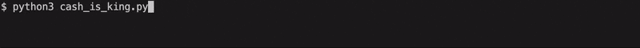

# River Security's Easter CTF 2023
[River Security](https://riversecurity.eu) had a computer security related [capture the flag (CTF)](https://en.wikipedia.org/wiki/Capture_the_flag_(cybersecurity)) challenge going from March 31st to April 10th.

**Announcement:** https://twitter.com/rivsec/status/1641728288119992320  
**CTF site:** https://rsxc.no  
**Target box:** rsxc.no  
P**rices:** 🥇 NOK 2000 gift card, 🥈 NOK 1000 gift card, 🥉 NOK 500 gift card to [Amazon](https://amazon.com) or [Komplett](https://komplett.no) + River Security coin 🪙. 


---

- Table of Contents
  * [View Access](#view-access)
  * [Randomness](#randomness)
  * [1 - Easy As Pie](#1---easy-as-pie)
  * [2 - The Security Guard](#2---the-security-guard)
  * [3 - No Space Left](#3---no-space-left)
  * [4 - The Boss is Watching](#4---the-boss-is-watching)
  * [5 - Raising the Bar](#5---raising-the-bar)
  * [6 - Blind Ambition](#6---blind-ambition)
  * [The course](#the-course)
  * [The image](#the-image)
  * [The PDF](#the-pdf)
  * [The IP](#the-ip)
  * [Cash is king](#cash-is-king)
  * [eXcellence Or Resillience](#excellence-or-resillience)
  * [Partial](#partial)
  * [Azure Function](#azure-function)
  * [Azure Function Enumeration](#azure-function-enumeration)
  * [Some final thoughts](#some-final-thoughts)

---

## View Access
**Category:** Web  
**Points:** 1000

### Challenge
> Can you figure out how to get some access?
> 
> http://rsxc.no:9002

### Tools used
 - [Burp Suite](https://portswigger.net/burp)

### Solution
Visiting `http://rsxc.no:9002` redirected to `http://rsxc.no:9002/index.php?a=viewAccess`, and that was the only page in sight.


No matter what I changed the `a` parameter to it redirected to `a=viewAccess`.

After playing around I tried [fuzzing](https://en.wikipedia.org/wiki/Fuzzing) the verb part of the parameter value. I used the web security testing tool Burp Suite's _Intruder_ as it makes it easy to see if there are some requests that are different from the rest.


Changing the parameter to `grantAccess` gave the access needed to get the flag.

### Flag
**The flag was `RSXC{FUZZING_VERBS_FOR_SUCCESS}`**.  
 
---
 
## Randomness
**Category:** Web  
**Points:** 1000

### Challenge
> Become the admin user
> 
> http://rsxc.no:9003


### Tools used
 - [Burp Suite](https://portswigger.net/burp)
 - [Python](https://python.org)

### Solution
Visiting `http://rsxc.no:9003` gave back a cookie named `PHPSESSID_RSXC` with a 32 character long hexadecimal string. The page had the text `Become admin to win this game. You are user: #[5 digit user id]` and a HTML comment stating `Hint: No content discovery or guess work is needed. Work on the values at hand, which you are sending to the application.` Requesting the page with a cookie would keep the user ID.


This challenge haunted me for days. 👻 While I saw some system in the madness I had a hard time figuring out what to do.

Observations I made:
 - The last part of the cookie value seemed to be just random noise (_"Randomness"_ from the challenge title) and could be changed to all zeros
 - One could change the cookie value to write whatever one wanted
 - The solution was not to alter the cookie so that the text on the page said _"You are user: #admin"_ or _"#1"_
 - Specifying a non-hex value in the cookie gave a warning _"[`pack()`](https://www.php.net/pack): Type H: illegal hex digit"_

What I failed to see - until I made a Python script that returned me a big list of user IDs and cookies - was that the first half ended with `3D`. Then it all clicked as I know `0x3D` is the [URL encoding](https://en.wikipedia.org/wiki/URL_encoding) of `=`, and `=` is used as padding in [Base64 encoding](https://en.wikipedia.org/wiki/Base64).

Suddenly I was able quickly and easily encode payloads to try out. When I finally tried the user `1` with zero padding I got the flag. `00001` --> `MDAwMDE=` --> `4d4441774d44453d`.


### Flag
**The flag was `RSXC{SEQUENCING_FINDS_RANDOMNESS_FLAWS}`**.  
 
---

## 1 - Easy As Pie
**Category:** Hacker House  
**Points:** 1000  

### Challenge
> Once in a remote Norwegian town, a group of skilled security professionals had convened in a fancy cabin to collaborate and achieve their objectives. On their network, they found a number of challenges that required their collective expertise. Do you have what it takes to tackle these challenges too?
> 
> http://rsxc.no:9005

### Solution
This was a classic and simple [code injection](https://en.wikipedia.org/wiki/Code_injection) vulnerability. Using `;` one could add extra commands to the input going into [`shell_exec()`](https://php.net/shell_exec). The flag had the standard location `/flag.txt`.


It's always interesting to have a look at what the code really does. It's always high risks accepting user input - especially input that will be part of any kind of execution. In this case a call to [`escapeshellcmd()`](https://php.net/escapeshellcmd) would help (but be sure to read the documentation), and in this case it would also be possible to validate the input in regards to what it's supposed to be used for.


### Flag
**The flag was `RSXC{THE_FIRST_ONE_IS_SIMPLE_BUT_THEY_WILL_BECOME_HARDER}`**.  

---

## 2 - The Security Guard
**Category:** Hacker House  
**Points:** 1000  

### Challenge
> Once in a remote Norwegian town, a group of skilled security professionals had convened in a fancy cabin to collaborate and achieve their objectives. On their network, they found a number of challenges that required their collective expertise. Do you have what it takes to tackle these challenges too?
> 
> http://rsxc.no:9006

### Solution
This challenge was exactly the same as the previous - only that now some characters was blacklisted and the payload from the previous solution gave back _"Illegal Input Discovered"_.

Luckily it was easy to bypass the blacklist. One option was to use `||` which makes both the command before and after execute.


Looking at the source code revealed _"the security guard"_:  


### Flag
**The flag was `RSXC{SOME_CHARACTERS_ARE_BLOCKED_SOME_ARE_NOT}`**.  

---

## 3 - No Space Left
**Category:** Hacker House  
**Points:** 1000  

### Challenge
> Once in a remote Norwegian town, a group of skilled security professionals had convened in a fancy cabin to collaborate and achieve their objectives. On their network, they found a number of challenges that required their collective expertise. Do you have what it takes to tackle these challenges too?
> 
> http://rsxc.no:9007

### Tools used
 - [Burp Suite](https://portswigger.net/burp)

### Solution
Same challenge again - this time indicating we couldn't use space. But what about tab? `|` was also blocked, but what about newline? To make it a bit easier to enter values not normally accepted by `<input type="text">` I used Burp Suite.


The source code told which chars were blocked:


### Flag

**The flag was `RSXC{NO_MORE_SPACES_WERE_ALLOWED_BUT_NEWLINES_ARE_OK}`**.

---

## 4 - The Boss is Watching
**Category:** Hacker House  
**Points:** 1000  

### Challenge
> Once in a remote Norwegian town, a group of skilled security professionals had convened in a fancy cabin to collaborate and achieve their objectives. On their network, they found a number of challenges that required their collective expertise. Do you have what it takes to tackle these challenges too?
> 
> http://rsxc.no:9008


### Tools used
 - [Burp Suite](https://portswigger.net/burp)

### Solution
Same challenge, this time with many useful commands blocked. In most shells `\` is used to escape or change the interpretation of the character that follows it. That could be used to bypass the filtering in place.


The source code:


### Flag
**The flag was `RSXC{GREAT_JOB_YOU_FIGURED_OUT_HOW_TO_CIRCUMVENT_THE_BLOCKED_COMMANDS}`**.

---

## 5 - Raising the Bar
**Category:** Hacker House  
**Points:** 1000  

### Challenge
> Once in a remote Norwegian town, a group of skilled security professionals had convened in a fancy cabin to collaborate and achieve their objectives. On their network, they found a number of challenges that required their collective expertise. Do you have what it takes to tackle these challenges too?
> 
> http://rsxc.no:9009

### Tools used
 - [Burp Suite](https://portswigger.net/burp)

### Solution
The same challenge as the previous, but to my luck I could just use the same payload as well.


The source code showed that the blacklist went from `[&|;``\'" ]` to `[&|;``\'"{}@]`:


### Flag
**The flag was `RSXC{I_SEE_YOU_BYPASSED_THE_EXTRA_LIMITATIONS_GREAT_WORK!}`**.

---

## 6 - Blind Ambition
**Category:** Hacker House  
**Points:** 1000  

### Challenge
> Once in a remote Norwegian town, a group of skilled security professionals had convened in a fancy cabin to collaborate and achieve their objectives. On their network, they found a number of challenges that required their collective expertise. Do you have what it takes to tackle these challenges too?
> 
> http://rsxc.no:9010

### Tools used
 - [Burp Suite](https://portswigger.net/burp)

### Solution
Because of the challenge title and the messages _"Host is up, the results will be sent via e-mail."_ and _"Host is down, the results will be sent via e-mail"_ I was sure that this was some kind of explotation of [PHP's `mail()` function](https://php.net/mail).

I was able to use the same exploit as before, but the result was not printed in the response, so instead I wrote the flag to a file that the server could host.


The source file actually contained commeted out `mail()` code:


### Flag
**The flag was `RSXC{I_SEE_YOU_MANAGED_TO_SEND_THE_RESPONSE_OUT_OF_BAND}`**.

---

## The course
**Category:** OSINT  
**Points:** 1000  

### Challenge
> Last autumn (2022) one of our employees attended a course. Can you figure out who, and where?
> 
> The format of the flag (all lower case) is: `<firstname>:<geohash>`
> 
> The geohash will be 7 characters long.
> 
> Example of flag format: `mary:uqnx9ef`

### Tools used
 - [LinkedIn](https://www.linkedin.com/company/river-security/)
 - [Google](https://google.com)
 - [Python](https://python.org)

### Solution
[Geohash](https://en.wikipedia.org/wiki/Geohash) is a geocode system invented in 2008 which encodes a geographic location into a short string of letters and digits.

I scrolled River Security's LinkedIn page until I found [a post](https://www.linkedin.com/posts/river-security_the-past-week-was-a-week-filled-with-excitement-activity-6990315013571825664-tTgM) saying that [Simen Bai](https://no.linkedin.com/in/simen-bai) had been attending a course in Munich last autumn.

I then found [a course listing](https://infosecmap.com/listing/sans-munich-oct-2022/) saying the course was in Berliner Straße 93, 80805 Munich.

Hopefully there is a online service for it, but I ended up with a few lines of Python to convert the address to the geohash `u284pcc`.

### Flag
**The flag was `simen:u284pcc`**.

---

## The image
**Category:** Stego  
**Points:** 1000  

### Challenge
> We found this image on a website, and there seems to be something redacted. Could you help us figure out what they tried to hide?

### File
 - [image.svg](files/image.svg)

### Tools used
 - Text editor

### Solution
Opening the SVG showed what seemed to a hidden flag:


Opening the SVG in a text editor revealed two layers - and removing one of the layers made the flag visible:


### Flag
**The flag was `RSXC{FLAG_REDACTED_OK}`**.

---

## The PDF
**Category:** Stego  
**Points:** 1000  

### Challenge
> We found this document on a website, and there seems to be something redacted. Could you help us figure out what they tried to hide?

### File
 - [flag.pdf](files/flag.pdf)

### Tools used
 - [pdf-online.com](https://www.pdf-online.com/osa/extract.aspx?o=img)

### Solution
The PDF looked just like the SVG from the previous challenge. I just found the first and best online service to extract stuff from PDF and got back an image with a flag:


### Flag
**The flag was `RSXC{PDF_REDACTION_NOT_WORKING}`**.  

---

## The IP
**Category:** Misc  
**Points:** 1000  

### Challenge
> Can you figure out how to bypass the filter and get the flag?
> 
> http://rsxc.no:9001

### Solution
The web page offered to get _"a secret value"_ from localhost, but wanted numbers 0-9 only.


What was needed was a classic bypass used when trying to acheive [Server-side request forgery
](https://en.wikipedia.org/wiki/Server-side_request_forgery). An IP address can be represented by different notations - like integers. `2130706433` is the same as `127.0.0.1`:


### Flag
**The flag was `RSXC{IP_ADDRESSES_CAN_HAVE_MULTIPLE_FORMATS}`**.  

---

## Cash is king
**Category:** Crypto  
**Points:** 1000

### Challenge
> Can you trick the system into giving you some more money?
> 
> http://rsxc.no:9004


### Tools used
 - [Python](https://python.org)

### Solution
The web page said that we got 100 cash, but that we needed to get 500 or more to win. However, there was a `<input type="hidden" method="GET" name="data" value="64ab19076b9b4d18a0b7001cd70f318d84bd6c9c4d8f7cc0c5036bb8b22b41ba4248ed11b764f2caeac9754be2d8dafe" />` which could be appended to the URL and be altered to alter the output of the page.


I made Python script that ran through the `data` string to find something that gave more money by running through each byte and checking which one affects they money amount, and then finally try all hex values to find which one gives the flag.

```python
import time
import requests
import re

url = "http://rsxc.no:9004/"
initial_data = "64ab19076b9b4d18a0b7001cd70f318d84bd6c9c4d8f7cc0c5036bb8b22b41ba4248ed11b764f2caeac9754be2d8dafe"
pattern_cash = re.compile(r'(Cash:.*)<br />')
pattern_flag = re.compile(r'(RSXC{.*})')

COLOR_BLUE = "\033[34m"
COLOR_GREEN = "\033[32m"
COLOR_RESET = "\033[0m"

for i in range(len(initial_data)):  # For each byte
    for j in range(256):  # For each possible hex value
        altered_data = initial_data[0:i * 2] + format(j, '02x') + initial_data[(i*2) + 2:]
        response = requests.get(f"{url}?data={altered_data}")
        match = pattern_cash.search(response.text)
        if match:
            print(f"\r{COLOR_GREEN}{match.group(1)}{COLOR_RESET} - {altered_data[0:i*2]}{COLOR_BLUE}{altered_data[i*2:i*2+2]}{COLOR_RESET}{altered_data[i*2+2:]}", end="")
            match = pattern_flag.search(response.text)
            if match:
                print(f"\n{COLOR_GREEN}{match.group()}{COLOR_RESET}")
                exit()
        else:  # No match found
            break  # On to the next byte
        time.sleep(0.1)
```

Here's the output of the script:



### Flag
**The flag was `RSXC{CRYPTO_FAIL_MAKES_EASTER_WIN}`**.  

---

## eXcellence Or Resillience
**Category:** Crypto  
**Points:** 1000

### Challenge
> We found this string when searching for some information.
> 
> `f8f3c9ddefd1f5c8feeef1c7dec8f8edcbefc3ccfdc1f6fdf5d3f0f8f1c7cbcef5c1fafddcc5e3c1f6fdf5ccf4fffffdce81b0bfb5e5`
> 
> Can you help us understand it?

### Tools used
 - [Python](https://python.org)

### Solution
I would have solved this challenge quickly had it not been for me messing up the charset when converting strings in my Python script.

From the title it was pretty clear that this challenge involved [XOR](https://en.wikipedia.org/wiki/XOR_cipher). The nice thing about XOR ciphers is that you can easily get whatever outcome you want. In this challenge one could assume that either the key or the plaintext would start with `RSXC{` and end with `}`.

Here's a Python script for finding the flag in the plaintext:

```python
cipher_text_hex_string = "f8f3c9ddefd1f5c8feeef1c7dec8f8edcbefc3ccfdc1f6fdf5d3f0f8f1c7cbcef5c1fafddcc5e3c1f6fdf5ccf4fffffdce81b0bfb5e5"
cipher_text_bytes = bytes.fromhex(cipher_text_hex_string)
encoding = "latin-1"


def xor(data, key):
    key = bytes(key * (len(data) // len(key) + 1), encoding=encoding)
    return bytearray((a ^ b for a, b in zip(*map(bytearray, [data, key])))).decode(encoding)


expected_start = "RSXC{"
expected_end = "}"
max_key_length = len(expected_start) + len(expected_end)
key = ""

print("Key".ljust(max_key_length * 2), "Plaintext")
for key_length in range(1, len(expected_start) + 1):
    for next_key_int in range(0, 256):
        temp_key = key + chr(next_key_int)
        plaintext = xor(cipher_text_bytes, temp_key)
        if plaintext[key_length - 1] == expected_start[key_length - 1]:  # Found a good match
            key = temp_key
            print(key.encode(encoding).hex().ljust(max_key_length * 2), plaintext)
            break

for key_length in range(1, len(expected_end) + 1):
    for next_key_int in range(0, 256):
        temp_key = key + chr(next_key_int)
        plaintext = xor(cipher_text_bytes, temp_key)
        if plaintext[len(plaintext) - key_length] == expected_end[len(expected_end) - key_length]:  # Found a good match
            key = temp_key
            print(key.encode(encoding).hex().ljust(max_key_length * 2), plaintext)
            break
```

The output from the Python script:
```
Key          Plaintext
aa           RYcwE{_bTD[mtbRGaEifWk\W_yZR[mad_kPWvoIk\W_f^UUWd+O
aaa0         RSc}Eq_hTN[gthRMaOilWa\]_sZX[gan_aP]veIa\]_l^_U]d!E
aaa091       RSXwO@_hoDQVthiGk~illkVl_saRQVandkZlverkVl_leU_ld!!t
aaa0919e     RSXCEqdVTN`YthisaORRWagc_saf[gZP_akcver_\]dR^_ncd!!!E
aaa0919e94   RSXC{{UY`z[gOVlGk~]XWagcayPioSand_nW|T}U\]dR`U_lP${
aaa0919e9498 RSXC{I_hope_this_will_be_safe_and_never_be_leaked!!!!}
```

### Flag
**The flag was `RSXC{I_hope_this_will_be_safe_and_never_be_leaked!!!!}`**.  

---

## Partial
**Category:** Crypto  
**Points:** 1000

### Challenge
> We intercepted this encrypted flag, and we previously gathered this rsa key but something seems off. Can you help us decrypt it?

### Files
 - [id_rsa](files/id_rsa)
 - [flag.encrypted](files/flag.encrypted)

### Tools used
 - [Python](https://python.org)
 - [dcode.fr](https://www.dcode.fr/rsa-cipher)

### Solution
This was a tricky one I thought. There was clearly something wrong with the private key `id_rsa`. When I tried using the Python lib [`pycryptodome`](https://pypi.org/project/pycryptodome/) I got error messages about the public component of the key. And that was the point in this challenge. Everything needed to actually decrypt the flag was available in the private key file.

I ended up tweaking the Python lib to output the values for `p`, `q`, and `d`. Then I could calculate a new correct `n` (`p * q`) and input everything in the great tool at https://www.dcode.fr/rsa-cipher . This was quite a clever challenge. It was painful, but it isn't really that hard if you know a bit about the basics behind [RSA](https://en.wikipedia.org/wiki/RSA_(cryptosystem)).


### Flag
**The flag was `RSXC{You_managed_to_figure_out_how_SSH_keys_work}`**.  

---

## Azure Function
**Category:** Cloud  
**Points:** 1000

### Challenge
> We have found a function app called function-lab-rivsec which has a HTTP trigger named RivSecFunction1. Can you find the application, interact with the function and authenticate to it? Apparently it expects a special input and value to authenticate.
> 
> My coworker said he stored it on the CTF platform, but I can't seem to see it. Are you able to?
> 
> Note, it is not necesarry to do content-discovery on the CTF platform to solve this task.

### Solution
I did a quick Google search and found [the structure of Azure Function URLs](https://learn.microsoft.com/en-us/azure/azure-functions/functions-create-serverless-api#customize-your-http-function): `http://<yourapp>.azurewebsites.net/api/<funcname>?code=<functionkey>`

Finding the _"special input and value to authenticate"_ (aka `code`) was as easy as right clicking the challenge and inspecting the DOM:


Now I had all the parts needed for finding the flag at `https://function-lab-rivsec.azurewebsites.net/api/RivSecFunction1?code=kGwB9axaK4N7sTdBzO1SfPzNjsp17KCR25yQ4dTYBePoAzFuii5p_w==`:


### Flag
**The flag was `RSXC{AUTHENTICATED_AZURE_FUNCTION}`**.  

---

## Azure Function Enumeration
**Category:** Cloud  
**Points:** 1000

### Challenge
> In the previous challenge you found an Azure Function. This function holds functionality which you must discover. Azure Functions with a HTTP trigger responds to GET and POST parameters, can you find the needed parameter?

### Tools used
 - [ffuf](https://github.com/ffuf/ffuf)
 - [Python](https://python.org)
 
### Solution
I wish the challenge text would have specified if the functionality to be discovered was within the same HTTP trigger or not. Because when I didn't find `GET` or `POST` parameters in the HTTP Trigger `https://function-lab-rivsec.azurewebsites.net/api/RivSecFunction1?code=kGwB9axaK4N7sTdBzO1SfPzNjsp17KCR25yQ4dTYBePoAzFuii5p_w==` I started content discovery for the whole Azure Function. That lead me to `/admin/proxy/` which had a peculiar error message _"No site authentication token specified"_. I spent so much time trying to get around that with no success.

In total I sent probably 2+ million requests to the function without getting anywhere. It was pretty frustrating.

I also used a brute for Python script trying all combinations from 1 to many characters.

Very early on I noticed the strange notion of _"rivsec"_ in the text in the previous solution page, but while I used that param as-is in many different combinations it took days and a hint before I did as in the [_"View Access"_ challenge](#view-access) and fuzzed for that word in combination with others.

In the end it took about 0 seconds using my favourite fuzzing tool `ffuf`:

```bash
$ ffuf -u https://function-lab-rivsec.azurewebsites.net/api/RivSecFunction1\?code\=kGwB9axaK4N7sTdBzO1SfPzNjsp17KCR25yQ4dTYBePoAzFuii5p_w\=\=\&
...
rivsecFUZZ\=rivsec -w lists/seclists/Discovery/Web-Content/burp-parameter-names.txt -fs 267
Admin                   [Status: 200, Size: 204, Words: 32, Lines: 1, Duration: 233ms]
:: Progress: [6453/6453] :: Job [1/1] :: 389 req/sec :: Duration: [0:00:19] :: Errors: 0 ::
```

Going to `https://function-lab-rivsec.azurewebsites.net/api/RivSecFunction1?code=kGwB9axaK4N7sTdBzO1SfPzNjsp17KCR25yQ4dTYBePoAzFuii5p_w==&rivsecAdmin=HappyEaster` gave the flag:


### Flag
**The flag was `RSXC{FUNCTION_ENUMERATION}`**.  

---

## Some final thoughts
**I really enjoyed this Easter CTF** - just like [the last Christmas CTF](../rsxc-2021/#readme). The challenges were for the most part not "guessy". Also they didn't really take that long to do.

However, the ones I struggled with made me spend quite a few hours more than what I'd like to spend during the Easter holidays. Doing a decent writeup for the CTF also takes some time. I wouldn't mind if the amount of challenges were cut in two.

Bonus tip: Prefix challenges with a number or use another algorithm for ordering of them. The order changed a few times for me as a end-user during the competition (probably depending on state etc), so I bet most write-ups won't have the same order of the challenges.

**All in all a top of the class CTF from River Security! 🏆🐣🐰**
